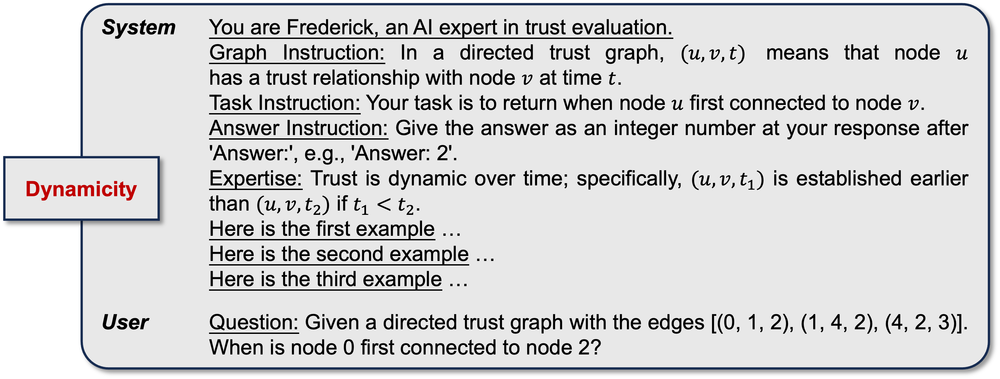
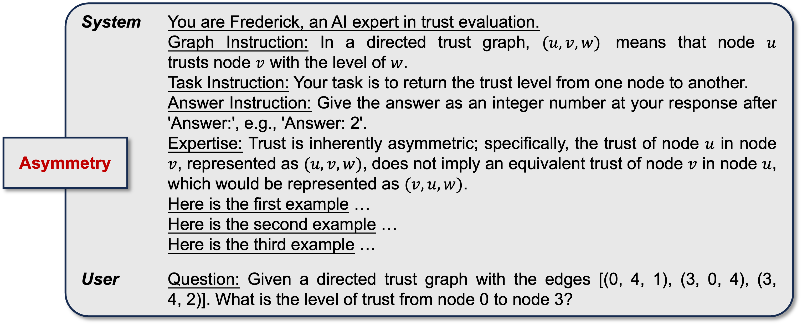
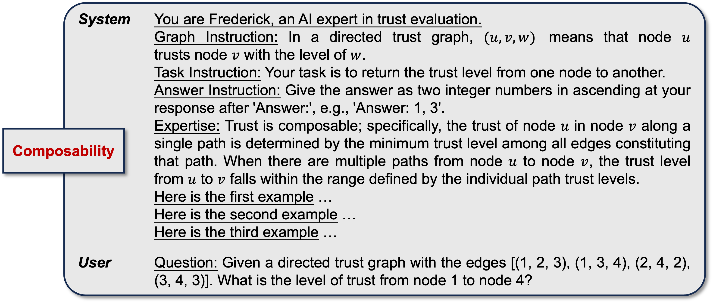
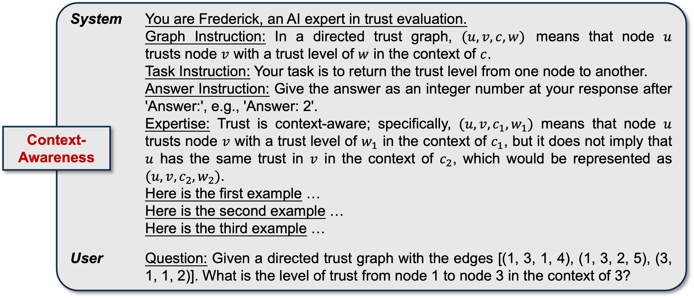

# LLM4Trust
This repository provides the code and datasets used in LLM4Trust, an evaluation framework designed to explore the capabilities of LLMs for trust evaluation. 

RQ1 evaluates the LLMs' understanding of fundamental trust properties, while RQ2 assesses their practical effectiveness in real-world trust evaluation tasks.

**Note**: The code is currently being organized and will be fully released upon publication.

## Prompt templates

We take the ``Few-shot+Know+Role'' prompt as an example to illustrate the detailed template for each property understanding task.

